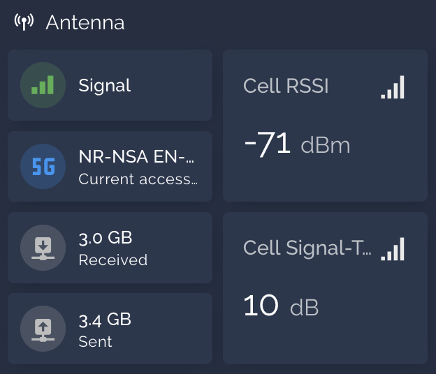

# ha-zyxel

-

Home Assistant integration for Zyxel devices.

## Supported devices

Confirmed working on:

- NR7101

Potentially compatible with a lot more devices.

Please report your device as working in the discussion area.

## Installation

Prerequisites:

1. The device must be reachable from your home assistant instance (they need to be on the same local network)
2. HTTP access must be enabled in the device's settings (it is the case by default)

### Install via HACS (recommended)

1. Install HACS
2. Navigate to HACS > Menu > Custom Repositories
3. Add this repository: https://github.com/zulufoxtrot/ha-zyxel
4. Set Type to Integration

### Install manually

1. SSH into your HA instance
2. Navigate to custom_components
3. git clone https://github.com/zulufoxtrot/ha-zyxel
4. Restart your HA instance

## Operation

## Credits

This integration uses the [n7101 library](https://github.com/pkorpine/nr7101) by pkorpine.