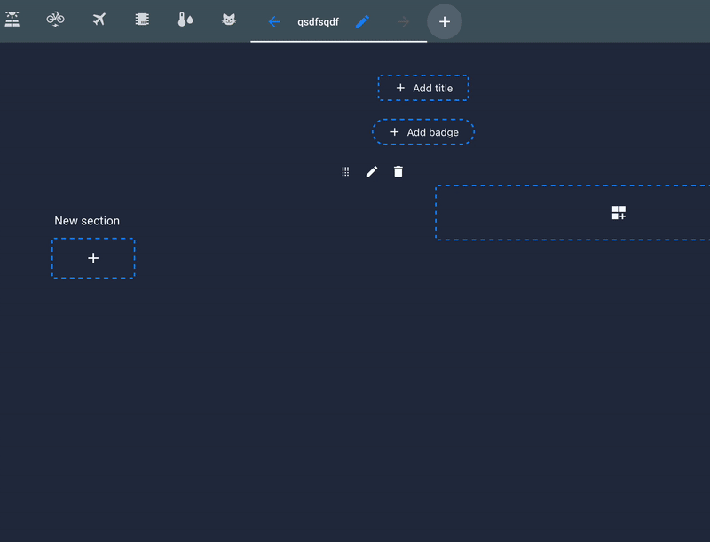

# ha-zyxel

> 📢 🤓 **This project is looking for maintainers** 📢 🤓
> 
> If you are interested, get in touch!

__Home Assistant integration for Zyxel devices__

## Supported devices

Confirmed working on:

- AX7501-B0
- FWA505
- FWA510
- FWA710 5G V2
- LTE3202-M437
- LTE7490-M904
- LTE5398-M904
- NR5103E
- NR5103v2
- NR5307
- NR7101
- NR7102
- NR7302
- VMG3625-T50B
- VMG4005-B50A
- VMG8825-T50

Potentially compatible with a lot more devices.
If you do test and find out your device is working, please submit an issue or a pull request and I'll add it to the list.

## Installation

Prerequisites:

1. The device must be reachable from your home assistant instance (they need to be on the same local network)
2. HTTP access must be enabled in the device's settings (it is the case by default)

### Install via HACS (recommended)

1. Install HACS
2. Click the big blue button above
3. Click Download and confirm
4. Restart HA

### Install manually

1. SSH into your HA instance
3. `git clone https://github.com/zulufoxtrot/ha-zyxel`
2. Navigate to `ha-zyxel/custom_components`
4. Copy `ha_zyxel` to your HA instance's `custom_components` directory
4. Restart your HA instance

## Adding a device

1. Go to HA Settings > Devices & Services.
2. Click Add Integration.
3. Search for Zyxel.
4. Select the Zyxel integration.
5. In Host, type your hostname IP, usually something like https://192.168.1.1 (⚠️ enter the full URL scheme with `https://`)
6. Type your admin username and password
7. Click Submit.

If connection fails, try with `http://` instead of `https://`.

## Adding cards to your dashboard

Add [this code](resources/card_example.yml) to your dashboard to add the cards pictured above. Follow the instructions from the animation below.

Note: the Mushroom card extension is required for the above code to work.

## Available entities

In theory, all items listed [here](https://github.com/pkorpine/nr7101?tab=readme-ov-file#example-output) should be available as entities. The entities are generated dynamically, meaning they can vary from one device to another. They depend on what the device lets us see.

The integration also creates:

- A connected-device count sensor
- Device trackers for discovered LAN clients
- Optional connectivity and diagnostic sensors for each client

Generic router telemetry and per-client diagnostic entities are disabled by
default to avoid creating an excessive number of active entities.

## Options

Select **Configure** on the integration to change:

- The router scan interval
- How long an unseen client is considered home
- Whether trackers for all discovered clients are enabled by default

## Support

Please submit an [issue](https://github.com/zulufoxtrot/ha-zyxel/issues).

## Credits

This integration uses the [n7101 library](https://github.com/pkorpine/nr7101) by pkorpine.
